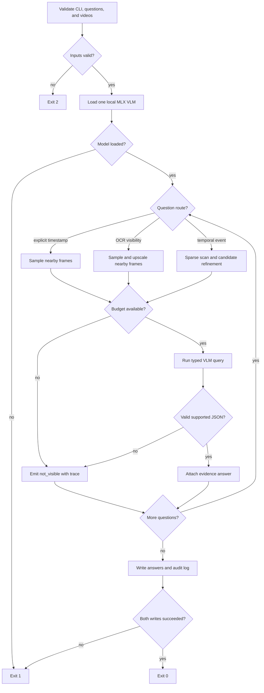

# Kitchen CCTV Agent design

Work unit: build one reproducible CLI that answers structured questions from fixed-camera kitchen videos, attaches evidence spans, logs frame/model cost, and remains below 1,500 frames and $0.30 API cost per 60 source minutes.

There are no existing integration points: this is a greenfield submission. The external contract is Builderr's `answer.py --videos ... --questions ... --out ... --log ...` interface.

## Acceptance criteria

- Validate question and video inputs before loading the model.
- Route explicit-timestamp state/count questions directly to nearby frames.
- Route temporal/event questions through a sparse scan, then refine candidate windows.
- Never exceed the scaled frame budget; local inference records `$0` API cost.
- Emit one schema-valid answer per input question, including evidence or `not_visible`.
- Record runtime, frames inspected, model calls, model identity, and question-level traces.
- Tests use hand-written expected outputs rather than asking the production model to validate itself.

## Pseudocode

```text
P1  receive CLI paths and configuration
P2  IF any required path is missing -> exit 2 with a contextual error
P3  CALL read and validate questions JSON
P4    IF JSON or schema validation fails -> exit 2 without loading the model
P5  CALL discover videos and probe duration/FPS
P6    IF a referenced video is missing or unreadable -> exit 2
P7  compute scaled per-video and total frame budgets
P8  CALL load the local MLX VLM once
P9    IF model load fails -> exit 1 with model identifier and original cause
P10 FOR EACH question in input order
P11   classify question route from declared type and text
P12   IF route is explicit timestamp/state/count
P13     sample a bounded neighbourhood around the requested timestamp
P14   ELSE IF route is OCR/visibility at an explicit timestamp
P15     sample and upscale a bounded neighbourhood around the timestamp
P16   ELSE
P17     sample sparse contact sheets over the full video
P18     CALL VLM to identify candidate evidence windows
P19       IF call or parse fails -> record failure and continue with no candidates
P20     IF candidates exist
P21       sample a bounded one-second refinement grid around candidates
P22     ELSE
P23       keep the sparse evidence only
P24   enforce remaining frame budget before every sample
P25     IF budget is exhausted -> emit `not_visible` with budget-exhausted trace
P26   CALL VLM with question, allowed answer type, timestamps, and selected images
P27     IF call or strict JSON parse fails -> emit `not_visible` with failure trace
P28   normalize answer to the declared type and clamp confidence to [0,1]
P29   IF answer is unsupported by a selected timestamp
P30     emit `not_visible` and empty evidence
P31   ELSE
P32     attach selected evidence span and append the answer
P33 WRITE answers JSON atomically
P34   IF write fails -> exit 1; do not claim a completed run
P35 WRITE run log JSON atomically
P36   IF write fails -> remove neither output; exit 1 and report incomplete audit log
P37 return exit 0
```

Completeness check: inputs, every fallible IO/model call, both arms of each decision, frame exhaustion, parse failure, and both output writes are explicit. No authorization is required. Concurrency is intentionally absent so one process owns the frame counter and output files. All acceptance criteria map to P2-P36.

## Proposed flow



Implementation risks:

- P11: free-form question routing can misclassify; the declared `type` always wins when present.
- P18/P26: model output may include prose around JSON; extraction is bounded to the first JSON object and then schema-validated.
- P24: duplicate timestamps across questions can waste budget; a frame cache keyed by `(video, millisecond)` counts each decoded frame once.
- P29: VLM confidence is not evidence. Answers without a timestamp selected from inspected frames are downgraded to `not_visible`.
