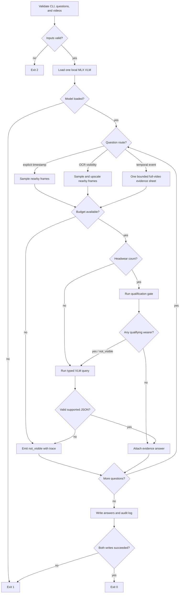

# Kitchen CCTV Agent design

Work unit: build one reproducible CLI that answers structured questions from fixed-camera kitchen videos, attaches evidence spans, logs frame/model cost, and remains below 1,500 frames and $0.30 API cost per 60 source minutes.

There are no existing integration points: this is a greenfield submission. The external contract is Builderr's `answer.py --videos ... --questions ... --out ... --log ...` interface.

## Acceptance criteria

- Validate question and video inputs before loading the model.
- Route explicit-timestamp state/count questions directly to nearby frames.
- Route temporal/event questions through one bounded 3×2 full-video evidence sheet.
- Never exceed the scaled frame budget; local inference records `$0` API cost.
- Emit one schema-valid answer per input question, including evidence or `not_visible`.
- Preserve non-empty JSON objects for the published structured-object answer type; reject malformed or non-finite object values as `not_visible`.
- Record runtime, frames inspected, model calls, model identity, and question-level traces.
- Tests use hand-written expected outputs rather than asking the production model to validate itself.

## Pseudocode

```text
P1  receive CLI paths and configuration
P2  IF any required path is missing -> exit 2 with a contextual error
P3  CALL read and validate questions JSON
P4    IF JSON or schema validation fails -> exit 2 without loading the model
P5  CALL discover videos and probe duration/FPS
P6    IF a referenced video is missing or unreadable -> exit 2
P7  compute scaled per-video and total frame budgets
P8  CALL load the local MLX VLM once
P9    IF model load fails -> exit 1 with model identifier and original cause
P10 FOR EACH question in input order
P11   divide the remaining shared frame budget across unanswered questions
P12   classify question route from declared type and text
P13   IF route is explicit timestamp/state/count
P14     sample a bounded neighbourhood around the requested timestamp
P14a    IF this is a headwear check, present the central frame as one full-width panel
P15   ELSE IF route is OCR/visibility at an explicit timestamp
P16     sample and upscale a bounded neighbourhood around the timestamp
P17   ELSE
P18     sample at most 6 evenly distributed frames within this question's allowance
P19     combine them into one timestamped evidence sheet
P20   enforce remaining frame budget before every sample
P21     IF budget is exhausted -> emit `not_visible` with budget-exhausted trace
P22   combine selected frames into one timestamped evidence sheet and CALL VLM once
P22a  IF this is a headwear count, first ask whether any person qualifies
P22b    IF no person qualifies -> return count 0 from that evidence
P22c    ELSE -> ask the typed numeric count question
P23     IF call or strict JSON parse fails -> emit `not_visible` with failure trace
P24   normalize answer to the declared type and clamp confidence to [0,1]
P24a  accept evidence timestamps as seconds or validated MM:SS/HH:MM:SS clock text
P25   IF type is object, structured_object, or short_structured_object
P26     IF answer is a non-empty JSON object containing only finite JSON values -> preserve it
P27     ELSE -> replace it with `not_visible`
P28   IF answer is unsupported by a selected timestamp
P29     emit `not_visible` and empty evidence
P30   ELSE
P31     attach selected evidence span and append the answer
P32 WRITE answers JSON atomically
P33   IF write fails -> exit 1; do not claim a completed run
P34 WRITE run log JSON atomically
P35   IF write fails -> remove neither output; exit 1 and report incomplete audit log
P36 return exit 0
```

Completeness check: inputs, every fallible IO/model call, both arms of each decision, shared-budget allocation, frame exhaustion, parse failure, structured-object validation, and both output writes are explicit. No authorization is required. Concurrency is intentionally absent so one process owns the frame counter and output files.

## Implemented flow



Implementation risks:

- P11: free-form question routing can misclassify; the declared `type` always wins when present.
- P14a: small contact-sheet cells can hide headwear detail; explicit headwear checks retain the sampled neighbourhood for evidence validation but give the model the central frame at full sheet width.
- P18/P22: model output may include prose around JSON; extraction is bounded to the first JSON object and then schema-validated. The temporal route uses one model call because repeated scouting calls caused reproducible generation degeneration on the local model.
- P20: duplicate timestamps across questions can waste budget; a frame cache keyed by `(video, millisecond)` counts each decoded frame once.
- P28: VLM confidence is not evidence. Answers without a timestamp selected from inspected frames are downgraded to `not_visible`.
